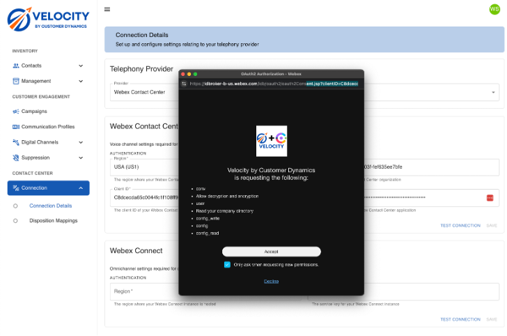

# Campaigns

## Setup

### Configure Custom Connector

Velocity communicates with the Webex CC Dialer through a Custom Connector. To set up a custom connector:

1. Open and login to [Webex Control Hub](https://admin.webex.com)
2. Click “Contact Center” in the left navigation area
3. Click “Integrations” in the left navigation area
4. Click the “Set Up” button on the “Custom Connectors” tile
5. Populate the pop up dialog with the following information:

| Environment   | Script URL                                               |
| -----------   | -------------------------------------------------------- |
| Development   | `https://velocity-dev.cd-ccs.net/assets/c2c.js`          |
| Staging       | `https://velocity-staging.cd-ccs.net/assets/c2c.js`      |
| Production    | `https://velocity.customerdynamics.com/assets/c2c.js`    |
| AU Production | `https://velocity.au.customerdynamics.com/assets/c2c.js` |
| UK Production | `https://velocitycustomerdynamics.uk/assets/c2c.js`      |

| Field               | Value                                           |
| ------------------- | ----------------------------------------------- |
| Name                | CampaignManagerCredential                       |
| Authentication Type | Basic Authentication                            |
| Resource Domain     | https://api.velocity.customerdynamics.com/login |
| User Name           | <Your Velocity User Name>                       |
| Password            | <Your Velocity Password>                        |
| Validation URL      | (leave empty)                                   |

6. Click "Done"

### Outdial Flow
A specific outbound flow is required for Velocity campaigns. For ease of setup, it's recommended to import the [Velocity Outbound Flow](../../flows/VelocityOutdialFlow.json) directly using the following steps. You can also reference the flow as you replicate it in an existing outdial flow if desired.

#### Prerequisites
Import the RemoveAgentBody Function:
1. Download the function [here](../../flows/RemoveAgentBody.json)
2. Click "Function" in the left navigation area
3. Click "Create a Function"
4. Choose "Import"
5. Drag the downloaded file to the import
6. Click Next
7. Click "Create Function"

Create necessary global variables:
1. Click "Flows" in the left navigation area
2. Click the "Global Variables" tab at the top of the page
3. Click "Create a global variable"
4. Populate the Name field with removeAgentBody, the Variable type as String, leave the default value blank, Report Settings and Desktop Settings as deselected.
5. Repeat steps 3 and 4 with the following settings: Name field campaignId, Description as "Velocity Variable", Variable type as String, leave the default value blank, Report Settings and Desktop Settings as deselected.
6. Repeat steps 3 and 4 with the following settings: Name field segmentId, Description as "Velocity Variable", Variable type as String, leave the default value blank, Report Settings and Desktop Settings as deselected.
7. Repeat steps 3 and 4 with the following settings: Name field contactId, Description as "Velocity Variable", Variable type as String, leave the default value blank, Report Settings and Desktop Settings as deselected.
8. Repeat steps 3 and 4 with the following settings: Name field FirstName, Description as "Velocity Variable", Variable type as String, leave the default value blank, Report Settings deselected, and Desktop Settings as SELECTED.
9. Repeat steps 3 and 4 with the following settings: Name field LastName, Description as "Velocity Variable", Variable type as String, leave the default value blank, Report Settings deselected, and Desktop Settings as SELECTED.

To import the flow:

1. Download the flow [here](../../flows/VelocityOutdialFlow.json)
2. Click "Flows" in the left navigation area
3. Click "Manage Flows"
4. Click "Import Flows"
5. Click "Choose a file" and select the downloaded JSON file
6. Click "Import"
7. Select the "Go to Flow Designer" button to open the flow
8. Toggle the edit button at the top of Flow Designer
9. In the right hand properties panel, update the `VelocityApiKey` variable with your Velocity API Key
10. Click the "Validation" toggle at the bottom
11. Click the "Publish Flow" button

### Outdial Queue

Set up an outdial queue. In the Contact Center area click on Queues in the left navigation area.

1. Click on "Create Queue"
2. Fill in the form

| Field             | Value                                 |
| ----------------- | ------------------------------------- |
| Name              | Use a recognizable name for the queue |
| Queue Type        | Telephony                             |
| Outbound Campaign | Yes                                   |

3. Set Call Distribution
   1. Click "Create Group"
   2. Select the team(s) desired
   3. Click "Save"
4. Click "Save"

### Outdial Entry Point

To run a Velocity campaign, an Outdial Entry point needs to be configured.

1. Inside of “Contact Center” area of Control Hub click “Channels” in the left navigation
2. Click “Create Channel”
3. Fill in the form with the following information:

| Field         | Value                                           |
| ------------- | ----------------------------------------------- |
| Name          | Use a recognizable name for the channel         |
| Description   | Describe, if desired                            |
| Channel Type  | Outbound Telephony                              |
| Timezone      | Select the time zone for your business          |
| Routing Flow  | Select your previously configured outbound flow |
| Version Label | Use the "Latest" label                          |
| Music on Hold | Select your preference                          |
| Outdial Queue | Select your previously configured queue         |

4. Click the "Create" button

### Connect Velocity to Webex

1. Open your [account info](https://admin.webex.com/account/info) and copy the Organization ID
2. Open the [Velocity app](https://velocity.customerdynamics.com)
3. Expand “Connection” in the left-hand navigation menu
4. Click on “Connection Details”
5. Select “Webex Contact Center” as the Provider
6. Select your Webex region
7. Paste in your Organization ID
8. Paste in the provided Client ID from Customer Dynamics
9. Paste in the provided Client Secret from Customer Dynamics
10. Click test connection (you may need to allow popups)
11. Login to your Webex account and approve the access

12. Click "Save"
13. Refresh the page

### Connect to Webex Connect  
1. Click the Overview in Control Hub - Top of Left Hand Nav
2. Select Webex Connect from the Quick Link - Right Hand Side of Page
3. Select the Service that contains the SMS channels
4. Select API from the Top Tab List
5. Select Service Key in the Auth Type drop-down - Top right-hand of the screen
6. Copy the Service Key and place it in the Velocity Service Key Field
7. Select the Webex Region. 
